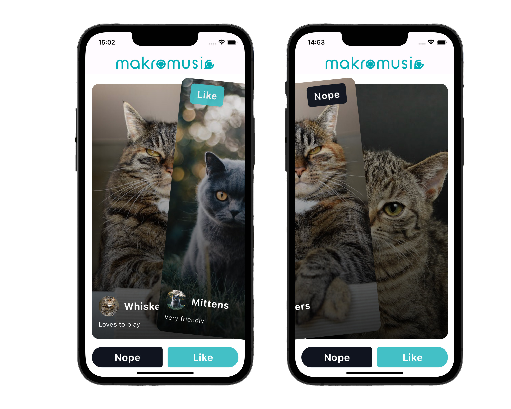

# MmSwipeable

# Image from assets



MmSwipeable is a Flutter package that provides a widget for enabling swipe actions in both left and right directions.

## Features

- Allows users to swipe a child widget either to the left or right.
- Does not automatically dismiss the child widget upon swipe; instead, triggers callback functions to handle the swipe actions.
- Enables customization of swipe action confirmation conditions.
- Supports programmatically controlling swipe actions through a dedicated controller.

## Installation

To use this package, add `mm_swipeable` as a dependency in your `pubspec.yaml` file:

```yaml
dependencies:
  mm_swipeable: ^1.0.0
```

Then import the package in your Dart code:

```dart
import 'package:mm_swipeable/mm_swipeable.dart';
```

## Usage
Wrap the widget that you want to make swipeable with the `MmSwipeable` widget and provide the necessary callback functions to handle swipe actions:

```dart
MmSwipeable(
  confirmSwipe: (angle, velocity) {
    return angle.abs() > 0.7 || velocity.abs() > 0.7;
  },
  onSwipedLeft: () {
    print('Swiped Left');
  },
  onSwipedRight: () {
    print('Swiped Right');
  },
  child: Container(
    width: 200,
    height: 200,
    color: Colors.blue,
  ),
)
```

You can also use a `MmSwipeableController` to programmatically control the behavior of the swipeable widget:

```dart
final swipeController = MmSwipeableController();

MmSwipeable(
  controller: swipeController,
  confirmSwipe: (angle, velocity) {
    return angle.abs() > 0.7 || velocity.abs() > 0.7;
  },
  onSwipedLeft: () {
    print('Swiped Left');
  },
  onSwipedRight: () {
    print('Swiped Right');
  },
  child: Container(
    width: 200,
    height: 200,
    color: Colors.blue,
  ),
)
```

```dart
// Programmatically trigger a swipe action
swipeController.swipeRight();
```

For more details and examples, check out the [example](example) directory.


